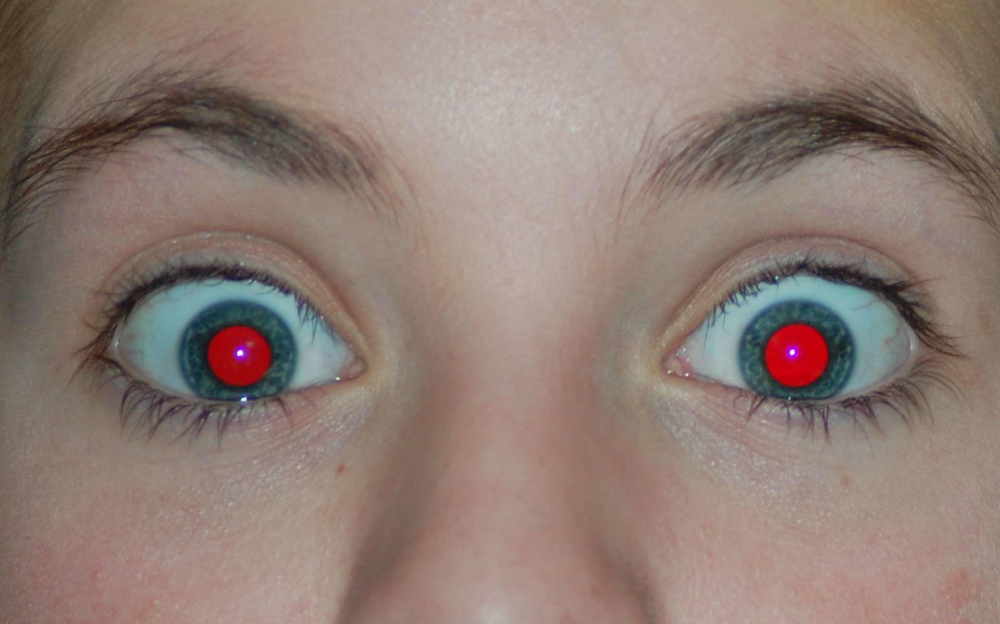
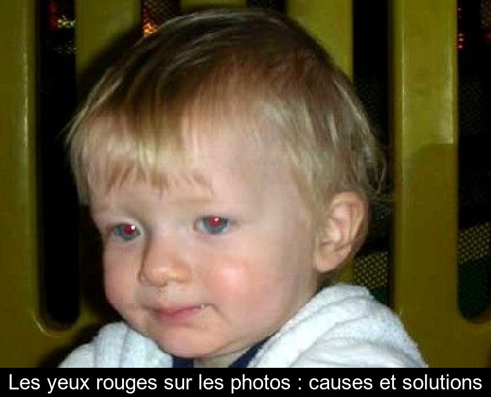

TP26 : Suppression des yeux rouges
===

Le but de ce TP est d'écrire un programme en `ocaml` permettant de
supprimer les yeux rouges sur une photo.

Ce programme travaillera sur une image au format ppm P3 et on lui
fournira les coordonnées d'un point dans un oeil rouge.

Exemple d'image (empruntée au site 
https://www.futura-sciences.com/tech/questions-reponses/photo-t-on-yeux-rouges-photos-6563/)
:


Vous pouvez récupérer une version ppm P3 de cette photo:
[photo1.ppm](photos/photo1.ppm). Un des yeux contient le point (427,672) et
l'autre le point (1548,648).

Voici ce que j'obtiens en appliquant ma solution de ce TP :


Je vous fournis le type `image` et la lecture et l'écriture de fichier (ce
serait un excellent exercice d'essayer de le faire, mais ça reste un
TP sur les graphes) :
[images.ml](src/images.ml).


### Question 0
Créer un fichier `yeux.ml` qui charge une image en mémoire grâce à la
fonction `charger_image : string -> image` fournie et la réécrie dans
le fichier `test.ppm` grâce à la fonction `sauvegarder_image : image
-> string -> unit` fournie.

Note et rappel:

* pour utiliser dans un autre fichier les fonctions écrites dans
`images.ml`, il faut écrire
```
open Images
```
au début de ce fichier;
* pour compiler, il faut que `images.ml` apparaisse _avant_ sur la
  ligne de commande que le nom du fichier qui l'utilise (avec `ocamlc`
  et `ocamlopt`).

### Question 1
Il s'agit dans ce TP de considérer une image comme un graphe dont les
sommets sont les pixels de l'image et il y a une arête entre deux
sommets si les pixels correspondants se touchent et sont tous les deux rouges.

Vous trouverez dans le fichier [yeux_rouges.ml](src/yeux_rouges.ml)
une fonction `rouge : couleur -> bool` qui teste si un pixel donné
sous la forme d'un tableau contenant les composantes RGB
correspondantes est rouge ou non.

Écrire une fonction
`voisins : Images.image -> int * int -> (int * int) list` qui renvoie
la liste des voisins du pixel dont les coordonnées sont données en
argument (attention à ne pas sortir des limites de l'image).


### Question 2
Pour trouver la zone dont on doit modifier la couleur, on doit
déterminer la composante connexe associée à un point (dont on sait
qu'il est dans cette zone). Pour cela vous allez implémenter
l'algorithme de parcours en largeur.

On a donc besoin d'une file et on va utiliser les files fournies par
le module [Queue](https://v2.ocaml.org/api/Queue.html) pour stocker
des coordonnées de pixels.

1. Écrire une fonction
`ajoute_sommets : (int * int) Queue.t -> (int * int) list -> unit`
qui prend en argument une file et une liste de coordonnées de pixel et
ajoute les éléments de la liste à la file.

2. Écrire une fonction
`composante_connexe : Images.image -> int * int -> bool array`
qui calcule la composante connexe d'un pixel. Le résultat est renvoyé
sous forme d'un tableau linéarisé de booléens représentant l'image, tel que la
case correspondant au pixel `(x, y)` contient `true` si et seulement si
le pixel de coordonnées `(x, y)` appartient à la composante connexe du
pixel fourni en argument.

### Question 3
Maintenant que nous sommes capable de repérer tous les pixels
correspondants à un œil rouge, il suffit de modifier la couleur de
cette œil. Pour cela, on ne peut pas se contenter de supprimer la
composante rouge, car on modifierait la luminosité et les reflets, ce
qui rendrait les yeux moins réalistes.

1. Écrire une fonction
`modif_coul : Images.image -> int * int -> unit` qui modifie la
couleur du pixel dont les coordonnées sont fournies en argument, en
remplaçant la composante rouge par la moyenne arithmétique entre les
deux autres composantes.

2. Écrire une fonction
`enlever_yeux_rouges : Images.image -> bool array -> unit` qui
parcourt le tableaux de booléens (qui correspond au tableau renvoyé
par la fonction `composante_connexe`) et pour les pixels concernés
modifie la couleur par un appel à `modif_coul`.


### Question 4
Écrire le programme qui permet de supprimer les yeux rouges de la
photo fournie. Le tester également sur la [photo
suivante](photos/photo2.ppm) provenant du site https://www.gralon.net/articles/photo-et-video/photo-et-video/article-les-yeux-rouges-sur-les-photos---causes-et-solutions-3471.htm:


